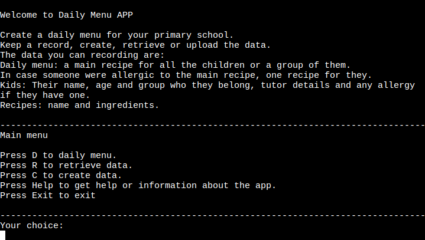
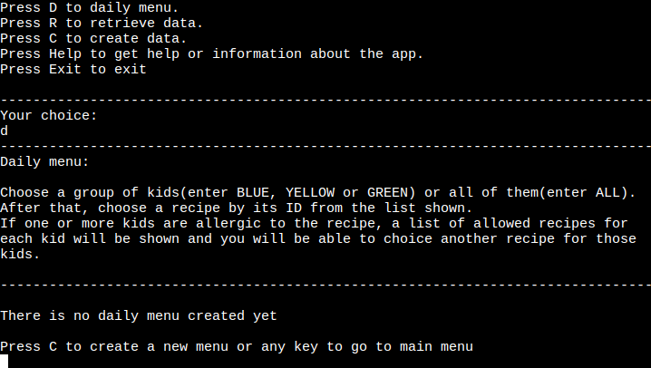
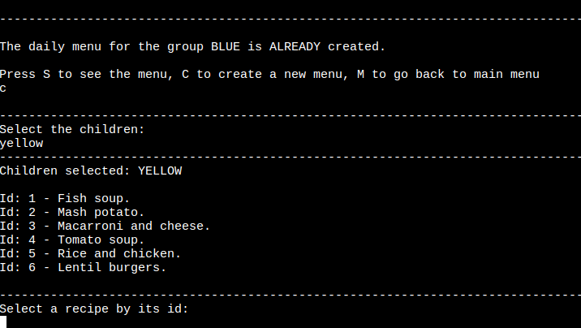
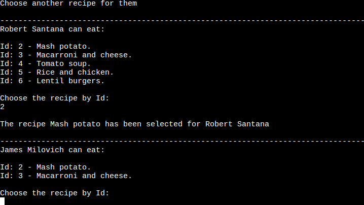
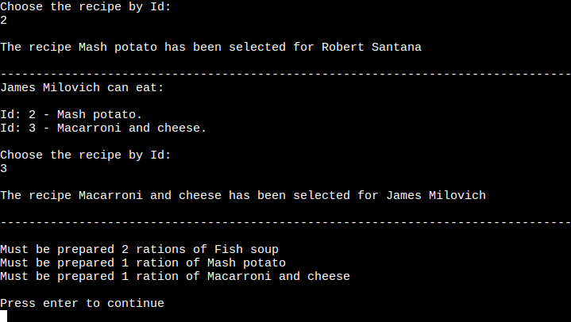
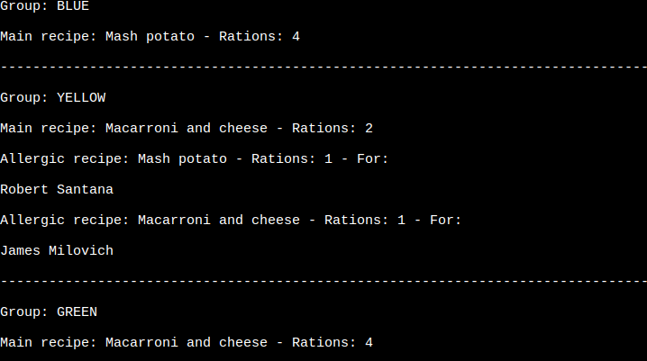
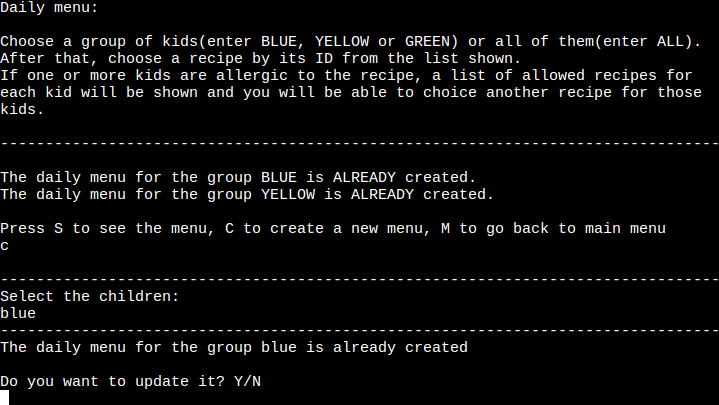

<!-- 

Welcome USER_NAME,

This is the Code Institute student template for deploying your third portfolio project, the Python command-line project. The last update to this file was: **August 17, 2021**

## Reminders

* Your code must be placed in the `run.py` file
* Your dependencies must be placed in the `requirements.txt` file
* Do not edit any of the other files or your code may not deploy properly

## Creating the Heroku app

When you create the app, you will need to add two buildpacks from the _Settings_ tab. The ordering is as follows:

1. `heroku/python`
2. `heroku/nodejs`

You must then create a _Config Var_ called `PORT`. Set this to `8000`

If you have credentials, such as in the Love Sandwiches project, you must create another _Config Var_ called `CREDS` and paste the JSON into the value field.

Connect your GitHub repository and deploy as normal.

## Constraints

The deployment terminal is set to 80 columns by 24 rows. That means that each line of text needs to be 80 characters or less otherwise it will be wrapped onto a second line.

-----
Happy coding! -->

# Daily Manu APP

The main goal of this app is to create a daily menu for a group of kids. The user can create kids and recipes data, then choose a group of kids or all of them and choose a recipe to create a daily menu.

When a kid is created, a list of allergies can be created if the kid has one or more.
Then, this list is compared against the ingredients of a recipe chosen, and if the kid is allergic to an ingredient, the user is alerted and they can choose another recipe for that kid.

## Features

### Welcome to the app

The first screen that the user sees is a welcome with a little explanation about the app and the main menu. 

They can choose to create a menu, retrieve data, create data, get some help or leave the app. 

### Help

Here the user can get a deeper explanation about the app.

### Cretae a menu

When the user enters the daily menu option, a screen is displayed indicating if a menu has already been created. If no menu has been created yet, the screen is as follows.

The user can choose to create a daily menu for a specific group or for all the children.

A list of all the recipes is displayed for the user choose one of them by its id.

This screen is shown when an user choose to create a menu for a specific group. A menu is already created in this screenshot.

Once the user has chosen a recipe, if one or more kids are allergic to it, the user must choose another recipe for them.

When all the kids have an assign recipe, every recipe chosen is show as well as the rations of each of them that have to be prepared.

From the daily menu panel the user can see which are the menus that have been already created. 

The user can update a menu if it is already created and the old menu will be replaced by the new one.

