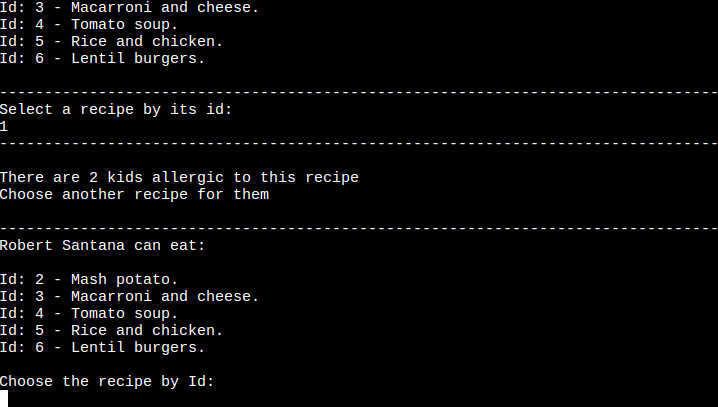

# Daily Manu APP

The main goal of this app is to create a daily menu for a group of kids. The user can create kids and recipes data, then choose a group of kids or all of them and choose a recipe to create a daily menu.

When a kid is created, a list of allergies can be created if the kid has one or more.
Then, this list is compared against the ingredients of a recipe chosen, and if the kid is allergic to an ingredient, the user is alerted and they can choose another recipe for that kid.

The app is a command line automation that runs in Python, the data is stored in a spreadsheet and to connect it I use Google Cloud, in which I enabled Google Sheet to connect to the spreadsheet and Google Drive where the credentials are setting up.

I used the libraries Google Auth to setup the authentication needed to access to Google Cloud and Gspread to access and update the spreadsheet.

## Diagrams to plan the project

In the beginning my idea was just create a database of kids and recipes. The user or admin could only add the data, but that data could not interact with each other.

### General app diagram

### Add user diagram

After a few days I had the idea to improve the app and make the daily menu in which the data interacted.

### General app diagram updated

### Daily menu diagram

## Features

### Welcome to the app

The first screen that the user sees is a welcome with a little explanation about the app and the main menu. 

They can choose to create a menu, retrieve data, create data, get some help or leave the app. 

### Help

Here the user can get a deeper explanation about the app.

### Cretae a menu

When the user enters the daily menu option, a screen is displayed indicating if a menu has already been created. If no menu has been created yet, the screen is as follows.

The user can choose to create a daily menu for a specific group or for all the children.

A list of all the recipes is displayed for the user choose one of them by its id.

This screen is shown when an user choose to create a menu for a specific group. A menu is already created in this screenshot.

Once the user has chosen a recipe, if one or more kids are allergic to it, the user must choose another recipe for them.

When all the kids have an assign recipe, every recipe chosen is show as well as the rations of each of them that have to be prepared.

From the daily menu panel the user can see which are the menus that have been already created. 

The user can update a menu if it is already created and the old menu will be replaced by the new one.

### Retrieve data

The user can retrieve data about kids grouping them by group, all of them or just one kid and data about one recipe or all of them as well.

In case there is a coincidence in the params of search, the user must choice an option choosing it by id.

### Create data

The user can create kid and recipes data. The app will guide them asking for all the data needed to create each one of them.

Every field to fill has its validator and an alert will be show to user in case they enter the wrong data.

When the data is saved a message is shown to the user

## Features left to implement

A nice feature would be to create a weekly menu, where the user could create a menu for every day of the week.

Another interesting feature would be to have the possibility to add quantity of each ingredient in a recipe, in grams or units, so that each recipe has a total amount of weight or units of ingredients, then a purchase list can be created from those ingredients for each recipe for the day or the week if the weekly menu had been implemented.

## Testing

### All the files pass the [PEP8](http://pep8online.com/) test successfully.

The run.py file as example

## Bugs

When a kid had more than one allergy to a recipe, they was counted as a different child as many time as there were allergies.

I fixed it adding a condition to the loop in which the allergic kids were counted: 

When I had two or more different allergy recipes and loaded them into the worksheet, only one would be saved. That was because I was rewriting the object.

In fact, I was making the code more complicated than it should be. The final code is as follow:

## Deployment

### The app has been deployed in Heroku.

First of all I had to create or in this case update a file with the needed requirements to the app works. It says to Heroku which dependencies are necessary to be implemented.

To do that I used the command `pip3 freeze --local > requirements.txt` . I had use first just `pip3 freeze > requirements.txt` but it didn't work.

Then I pushed the code to github and create a Heroku account. Create an account is very easy, just register the email and follow the tipical steps to finish the registration.

In Heroku I had to create a new app, give it a name and choosing a region.

Once the app is created, I went to setting, in config vars configuration, I setted the environment variables that were two, `CREDS = creas.json` and `PORT = 8000`.

Next step is to add two buildpacks, Python and Node. In that order. That is very important.

Then I went to deploy section and connect the app with the github repository. There are two ways to connect it with github, enable automatics deploys if we want to every time we push a commit the app automatically rebuild or manually deploy which was what I used this time.

After this if there is no problem with the code, the app will be build.

[The app is runnig here](https://ale-daily-menu.herokuapp.com/)

## Used libraries

### External

#### Gspead

[Gspread](https://docs.gspread.org/en/v5.1.1/) is a Python API for Google Sheets.

This library allow us to read, write, update and delete data from a spreadsheet.

First of all you have to open a project as a client `GSPREAD.CLIENT.open('name of the project')` and assign it to a variable.
After that you can select a worksheet `worksheet('name of the worksheet')` and assign it to variable as well.

Then you can start to get and set data in that spreadsheet. Here is an example as how you can get all the values of a worksheet as dictionaries.

#### Google Auth

[Google Auth](https://console.cloud.google.com) library allows us to access Google Cloud safely through a method called Credentials.

We have to call a method called from_service_account_file and pass to it our credential as a parameter. We get our credentials from our Google Cloud account inside the project we are working with and save it as a enviromenment variable in our local project. Save it in a variable

Then using the previous variable created we call the with_scopes method passing to it the scope that we need to authorize. Save it in a variable

Finally we need to authorize the gspread library to work in our project. To do that gspread has a method called authorize in which we have to pass the previous created variable in which we saved the scope variables.

The process is as follow:

### Python built-in libraries 

#### Re

[Re](https://docs.python.org/3/library/re.html) is a regular expression library that allow us to check if a sentence match with a expression set for us. I used it to validate the user inputs.

#### Datetime

[Datetime](https://docs.python.org/3/library/datetime.html) library that supplies classes to work with date and time. I used it to get the date. I needed the date to create a daily menu and for check if a menu already exists when the user is going to create one.

#### Json

[Json](https://docs.python.org/3/library/json.html) library allow us to work with JSON data, to convert a file JSON to string and a string to a JSON file. I used it to the method loads('string to convert) to get a JSON file from the data that is coming from the worksheet. And I used it to convert a JSON file to a string with the method dumps(JSON file)
to send the data to the worksheet.
